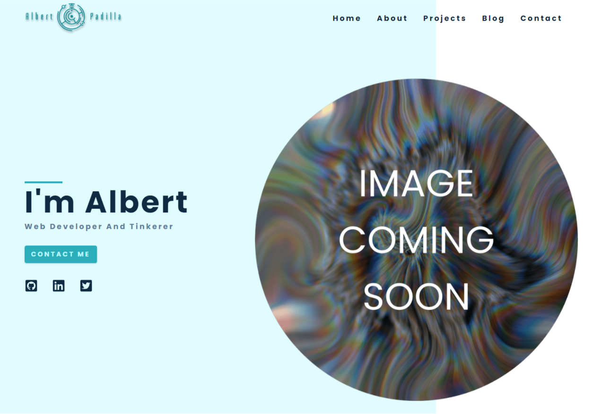

  

<h1 align="center">
  Gatsby Portfolio
</h1>

<h3 align="center">My portfolio site built with Gatsby and Strapi</h3>

<a href="https://www.albertpadilla.com/">https://www.albertpadilla.com/</a>

🦒

_The design was taken from John Smilga's Udemy course (a great course and an awesome teacher)_

### Built with :

- Gatsby.js
- Strapi (CMS)
- Formspree (email contact form)

